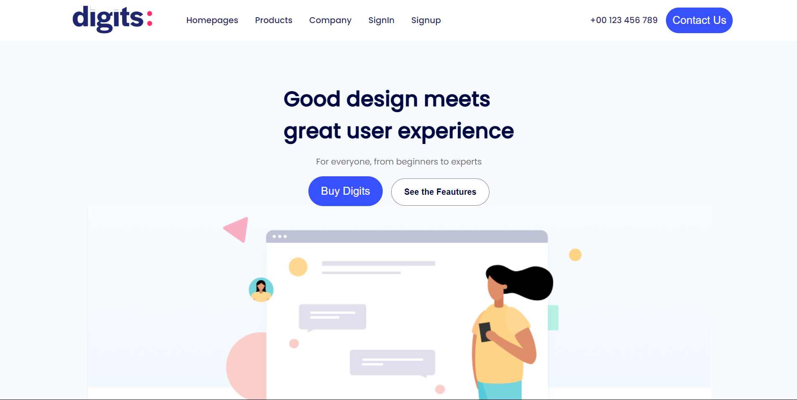
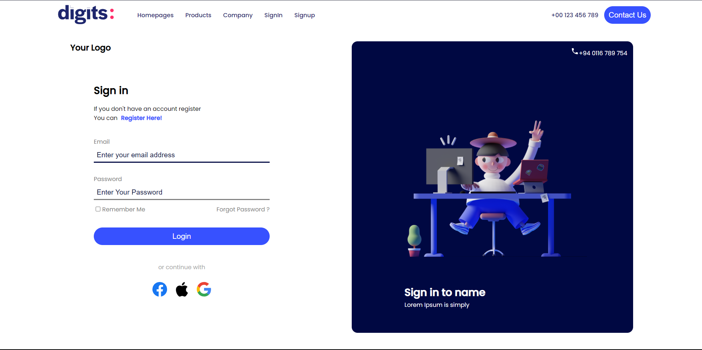
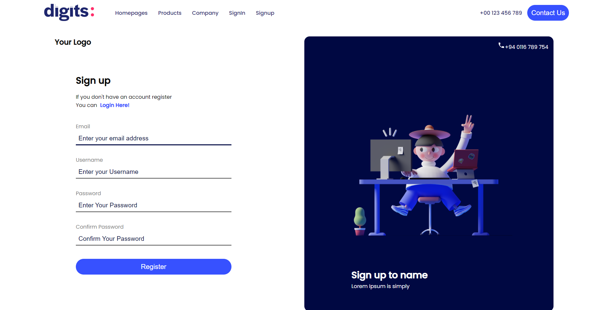

# Lean App Landing Page and SignUp/SignIn page
UI for Landing Page and SignIn/ SignUp form for the Lean App.

## Live Link
Access this [webApp](https://lean-app-ui.netlify.app)

## Table of Context:

-[About the App](#about-the-app)

-[Screentshot](#screenshot)

-[Technologies](#technologies)

-[Setup](#setup)

-[Status](#status)

## About the App
Lean App is assignment app made with React, React-Router, HTML and custom CSS

## Screenshot

## Technologies
HTML, CSS, JS, React, react-Router & `Icones` for the icons

## Setup
- download or clone the repository
- run `npm install`

## Status
Completed
